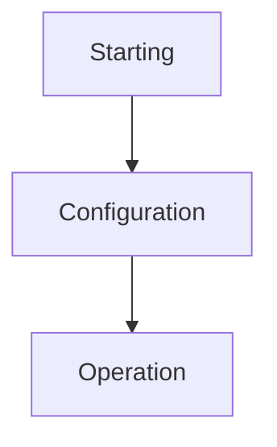
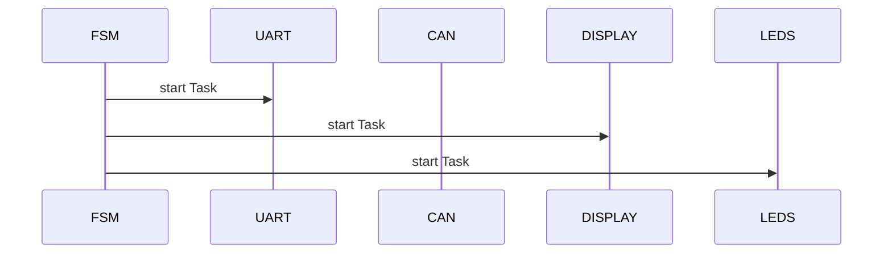
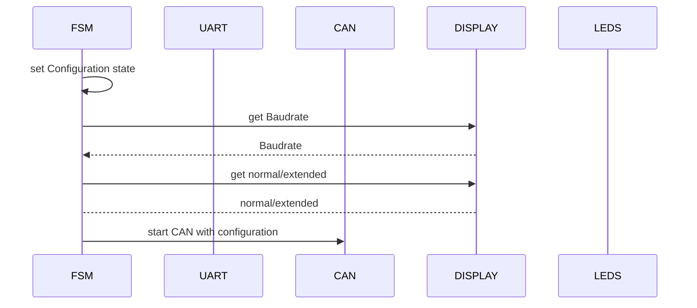
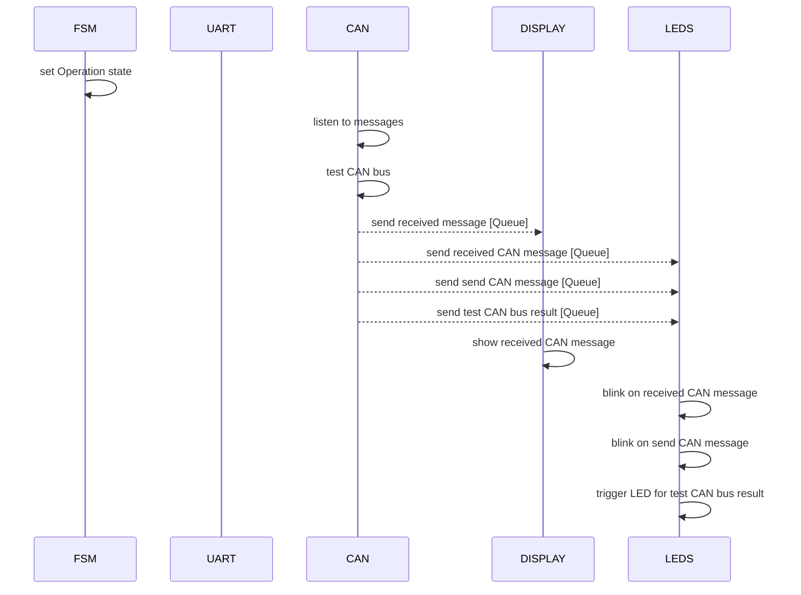

# can-to-go-system Software 
## System
- microcontroller: esp32
- framework: espidf

## System Architecture

```mermaid
  flowchart TB
    Starting[Starting]
    Configuration[Configuration];
    Operation[Operation]
    Starting --> Configuration --> Operation
```

## States
### Starting

```mermaid
sequenceDiagram
    participant FSM
    participant UART
    participant CAN
    participant DISPLAY
    participant LEDS

    FSM->>UART: start Task
    FSM->>DISPLAY: start Task
    FSM->>LEDS: start Task
```

### Configuration

```mermaid
sequenceDiagram
    participant FSM
    participant UART
    participant CAN
    participant DISPLAY
    participant LEDS

    FSM->>FSM: set Configuration state
    FSM->>DISPLAY: get Baudrate
    DISPLAY-->>FSM: Baudrate 
    FSM->>DISPLAY: get normal/extended
    DISPLAY-->FSM: normal/extended

    FSM->>CAN: start CAN with configuration
```

### Operation

```mermaid
sequenceDiagram
    participant FSM
    participant UART
    participant CAN
    participant DISPLAY
    participant LEDS

    FSM->>FSM: set Operation state
    CAN->>CAN: listen to messages
    CAN->>CAN: test CAN bus
    CAN-->>DISPLAY: send received message [Queue]
    CAN-->>LEDS: send received CAN message [Queue]
    CAN-->>LEDS: send send CAN message [Queue]
    CAN-->>LEDS: send test CAN bus result [Queue]
    DISPLAY->>DISPLAY: show received CAN message
    LEDS->>LEDS: blink on received CAN message
    LEDS->>LEDS: blink on send CAN message
    LEDS->>LEDS: trigger LED for test CAN bus result
```